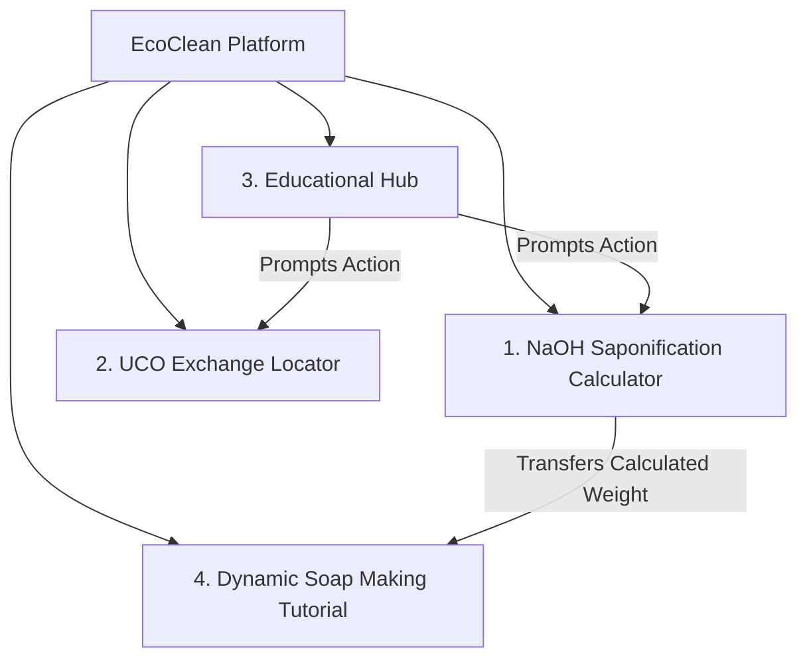
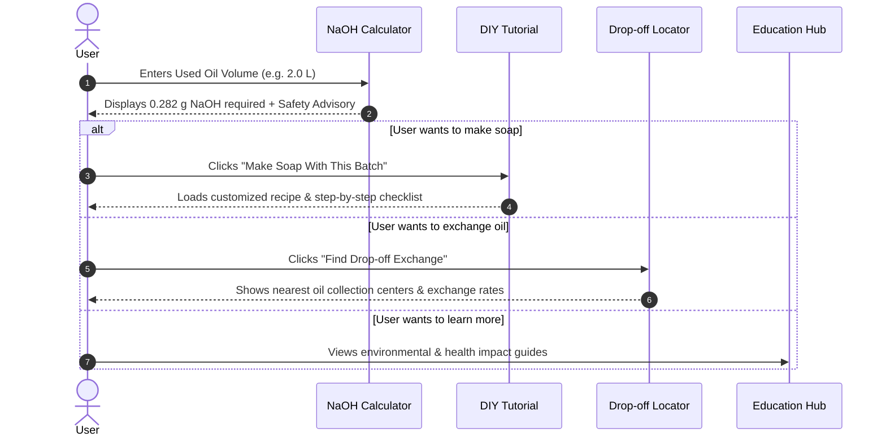

# Product Requirements Document (PRD)

## Project Name: EcoClean
**Document Version:** 1.0.0  
**Status:** Approved / Draft  
**Target Release:** MVP (Phase 1)  

---

## 1. Executive Summary & Vision

### 1.1 Problem Statement
Improper disposal of used cooking oil (minyak jelantah) is a major environmental hazard in Kabupaten Buleleng, Bali. Pouring oil into municipal gutters, rivers, or kitchen drains pollutes local watersheds, damages the marine ecosystems and coral reefs of Lovina and Pantai Penimbangan, creates concrete-like fatberg blockages in sewers, and contaminates agricultural groundwater. Furthermore, repeatedly reusing cooking oil in households and food stalls generates toxic free radicals, lipid peroxides, and carcinogenic compounds. Households and local food vendors often lack accessible tools to calculate saponification ratios for upcycling into soap, or lack information on where to exchange jelantah for cash or groceries.

### 1.2 Product Vision
**EcoClean Buleleng** is an eco-action web platform tailored for Indonesian users, specifically in **Kabupaten Buleleng, Bali**. The platform provides:
1. An accurate **NaOH Saponification Calculator** using the formula $\text{Gram NaOH} = \text{Minyak (Liter)} \times 0.141$.
2. A localized **UCO Drop-off & Exchange Directory & Map** covering Singaraja, Lovina, Seririt, Sukasada, Kubutambahan, and Gerokgak.
3. An **Educational Impact Simulator** detailing ecological damage to Bali's waters and cardiovascular health hazards.
4. A **Dynamic Step-by-Step Soap Making Tutorial** synchronized with the calculator's batch size and featuring a strict personal safety gate.

### 1.3 Key Objectives & Success Metrics (KPIs)
- **Primary Audience:** Indonesian households, warung makan, eco-conscious communities, and students in Buleleng, Bali.
- **Language & Currency:** Bahasa Indonesia and Indonesian Rupiah (IDR).
- **Environmental Impact:** Liters of used cooking oil diverted from Buleleng's coastal waters.
- **Safety First:** 100% adherence to chemical safety warnings (PPE, exothermic NaOH dissolution rules).

---

## 2. Target Audience & User Personas (Buleleng, Bali)

| Persona | Role / Description | Primary Needs |
| :--- | :--- | :--- |
| **Ibu Rumah Tangga (Ni Luh)** | Resident in Singaraja who produces 1–3L of used cooking oil monthly. | Wants an easy, safe way to convert waste cooking oil into soap for washing dishes and clothes. |
| **Pengelola Warung / Katering (Pak Ketut)** | Food stall owner in Lovina generating >5L of jelantah weekly. | Needs a reliable drop-off map with competitive IDR cash exchange rates (Rp 7.000–8.000/L). |
| **Aktivis / Komunitas Lingkungan (Wayan)** | Youth/student activist at Undiksha Singaraja or coastal community. | Needs educational tools, impact simulators, and verified drop-off hubs to advocate zero-waste habits. |

---

## 3. Core Feature Requirements

---

### Feature 1: Dynamic NaOH Saponification Calculator

#### 1.1 Purpose
Enables users to calculate the exact amount of Sodium Hydroxide ($\text{NaOH}$ / Lye) required to saponify their specific volume of used cooking oil into soap.

#### 1.2 Functional Specifications
- **Input:**
  - Volume of used cooking oil in **Liters ($L$)** (Numeric input + quick-preset buttons: $0.5L$, $1.0L$, $2.0L$, $5.0L$, custom slider).
- **Core Formula & Ratio:**
  $$\text{Gram of NaOH} = \text{Minyak Jelantah (Liter)} \times 0.141$$
  $$\text{Perbandingan Minyak : Air} = 7 : 2 \implies \text{Air (Liter)} = \frac{2}{7} \times \text{Minyak (Liter)}$$
- **Calculated Outputs:**
  - Required $\text{NaOH}$ weight in **Grams ($g$)**.
  - Water volume based on $7:2$ ratio (misal $1\text{L}$ minyak membutuhkan $\frac{2}{7}\text{L} \approx 285.7\text{ ml / gram}$ air suling).
  - Estimated soap yield (bars or approximate weight).
- **Interactive Actions:**
  - **"Apply to Tutorial" Button:** Dynamically populates the DIY Soap Making Tutorial with these exact measurements.
  - **Copy / Save Recipe:** One-click recipe summary copy to clipboard.
  - **Lye Safety Warning Banner:** Prompts user regarding caustic chemical safety precautions before proceeding.

---

### Feature 2: Used Cooking Oil (UCO) Exchange & Drop-Off Locator

#### 2.1 Purpose
Provides a directory and interactive map of verified drop-off points, recycling banks, and commercial buyers where users can exchange used cooking oil for rewards, cash, or eco-points.

#### 2.2 Functional Specifications
- **Search & Filter:**
  - Search by city, postal code, or current GPS location.
  - Filter by: Accepted Oil Types, Reward Type (Cash, Vouchers, Community Drop-off), Minimum Accepted Volume, Opening Status (Open Now).
- **Location Detail Card:**
  - Name of drop-off point / partner organization.
  - Full address, operating hours, contact phone / WhatsApp.
  - Exchange rate / incentive per liter (if applicable).
  - Guidelines for drop-off containers (e.g., filtered oil in PET bottles).
  - Integrated "Get Directions" (Google Maps / Waze link).
- **Interactive Map View:**
  - Pin markers with clustering for high-density areas.
  - List / Map toggle for mobile responsiveness.

---

### Feature 3: Educational Hub (Environmental & Health Dangers)

#### 3.1 Purpose
Educates users on the hazards of improper oil disposal and health risks associated with repeatedly reusing cooking oil.

#### 3.2 Content & Functional Modules
1. **Environmental Impact:**
   - **Water Pollution:** How 1L of oil ruins freshwater ecosystems and suffocates aquatic life.
   - **Plumbing & Sewers:** Fatberg formation, pipe corrosion, and taxpayer burdens on municipal wastewater treatment.
   - **Soil Toxicity:** Disruption of soil pH and agricultural degradation.
2. **Health Hazards of Reusing Cooking Oil:**
   - Thermal degradation, oxidation, and free radical formation.
   - Production of carcinogenic compounds (Polycyclic Aromatic Hydrocarbons - PAHs, acrylamides).
   - Increased risk of hypertension, atherosclerosis, and liver damage.
3. **Interactive Tools:**
   - **Eco-Impact Impact Counter:** Real-time visual calculator demonstrating liters of water saved and $CO_2$ footprint avoided when recycling used oil.
   - Downloadable Infographics & FAQs.

---

### Feature 4: Step-by-Step DIY Soap Making Tutorial

#### 4.1 Purpose
A beginner-friendly, safety-first guide teaching users how to convert used cooking oil into household cleaning soap (dishwashing soap, floor cleaner, stain remover bars).

#### 4.2 Dynamic Recipe Integration
- The tutorial dynamically inherits measurements from the **NaOH Calculator**:
  - Example: For $1.5L$ oil $\rightarrow 0.2115\text{g NaOH}$ + dynamic water volume.
  - Option to manually adjust batch size directly on the tutorial page.

#### 4.3 Sequential Interactive Workflow
1. **Phase 1: Safety & Workspace Prep (Mandatory Safety Gate)**
   - Required PPE Checklist: Nitrile/rubber gloves, eye protection goggles, long sleeves, ventilated area / outdoors.
   - Rule #1: **"Always add NaOH crystals to water slowly, NEVER water to NaOH"** (exothermic reaction warning).
2. **Phase 2: Oil Purification & Preparation**
   - Filtering food residues through fine mesh/cheesecloth.
   - Optional deodorizing / clarifying technique (activated charcoal or aromatic boiling with lemongrass/citrus peel).
3. **Phase 3: Making the Lye Solution**
   - Dissolving NaOH in cold water, monitoring heat dissipation.
4. **Phase 4: Saponification & Reaching Trace**
   - Blending oil and lye solution using immersion blender / hand whisk until reaching "trace" consistency.
   - Optional add-ins for cleaning soap: Essential oils, coffee grounds (exfoliant scrub), sodium carbonate.
5. **Phase 5: Pouring, Molding, and Curing**
   - Pouring into silicone or lined molds.
   - Insulating for 24–48 hours, unmolding, cutting, and curing for 3–4 weeks for full pH neutralization.
6. **Safety & Troubleshooting Accordion:**
   - False trace vs. true trace, vinegar neutralizer emergency protocol, pH testing methods.

---

### Feature 5: EcoClean Products & Ingredients Marketplace

#### 5.1 Purpose
Provides a built-in store catalog for users to purchase raw materials (NaOH, Aquades), eco-friendly soaps, custom jelantah soap-making services, and all-in-one starter kits with direct WhatsApp order integration.

#### 5.2 Product Lineup
1. **Sabun Eco (Batang Pembersih Alami):** Rp 15.000 / batang (100g). Multi-purpose household cleaning soap upcycled from jelantah with lemongrass & lime extract.
2. **Soda Api Murni (NaOH Saponifikasi 99%):** Rp 25.000 / 500g. High-purity caustic soda pearls specific for soap crafting with safety guidelines.
3. **Aquades Murni (Demineralized Water):** Rp 12.000 / 1 Liter. Mineral-free pure water (<0.1 µS/cm) preventing lime scale & ensuring lather quality.
4. **Jasa Pengolahan Jelantah ke Sabun:** Rp 45.000 / 5 Liter. Custom crafting service where users send their jelantah and receive ~45 ready-to-use cured soap bars.
5. **Paket Bundling Pemula (Starter Kit Complete):** Rp 95.000 / paket. All-in-one starter box: NaOH 500g + Aquades 1L + Silicone Flower Mold + Safety Goggles + Rubber Gloves + Free Eco Soap Bar & Printed Recipe Guide.

#### 5.3 Shopping Cart & WhatsApp Checkout
- Interactive cart drawer with item counter badge in navigation header.
- Category filters (*Semua Produk*, *Bahan Baku*, *Produk Olahan*, *Jasa Pembuatan*, *Bundling Hemat*).
- One-click checkout generating a formatted WhatsApp message to EcoClean Buleleng (`https://wa.me/6289603372387`).

---

## 4. User Experience & User Flow

---

## 5. Technical Architecture & Tech Stack

### 5.1 Technology Recommendations
- **Frontend Framework:** Modern React (Next.js / Vite) or clean Semantic HTML5 + Vanilla JS / CSS Design System.
- **Styling & Design System:** Modern glassmorphic & eco-modern design palette (forest greens `#10B981`, clean teals `#0EA5E9`, warm neutrals, sleek dark/light mode toggle).
- **Mapping & Geolocation:** Official Google Maps JavaScript API (Buleleng, Bali vector map, custom eco-markers, rich InfoWindows, and Geolocation).
- **Data Architecture:** Static JSON / LocalStorage for offline-first calculation saving, with headless CMS / API endpoints for exchange locations.

---

## 6. Non-Functional Requirements

- **Mobile First & Responsive:** Fully responsive across all devices (Smartphones, Tablets, Desktops).
- **Safety First UX:** High-contrast hazard alerts and mandatory safety confirmation before viewing chemical mixing steps.
- **Accessibility (a11y):** WCAG 2.1 AA compliant, screen-reader friendly inputs, clear focus states.
- **Performance:** Sub-1.5s First Contentful Paint (FCP), Lighthouse score > 90 in Performance and SEO.
- **SEO & Discoverability:** Rich OpenGraph metadata, structured JSON-LD schemas for `HowTo` (Soap Making Tutorial) and `LocalBusiness` / `Place` (Drop-off centers).

---

## 7. Product Roadmap & Phasing

| Phase | Scope / Deliverables | Timeline |
| :--- | :--- | :--- |
| **Phase 1: MVP Launch** | • Interactive NaOH Calculator with $0.141$ formula • Dynamic Step-by-Step Soap Making Tutorial • Environmental & Health Education Hub • Initial Curated Drop-off Location Directory | Week 1–3 |
| **Phase 2: Enhanced Interactivity** | • Geolocation-enabled interactive Leaflet map • Community Impact Dashboard (total liters diverted) • Printable & downloadable PDF recipe cards | Week 4–5 |
| **Phase 3: Community & Rewards** | • User submissions for new drop-off centers • Exchange partner verification portal • Multi-language localization | Week 6+ |
